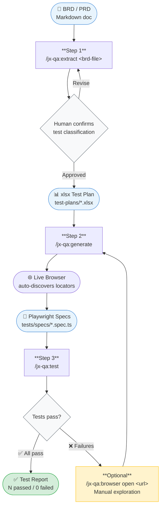

# QA Documentation Workflow

## Document Metadata
- **Feature ID**: 001
- **Feature Name**: QA Documentation Workflow
- **Document Type**: BRD_PRD
- **Generated Date**: 2026-05-20

## Document Control

| Attribute | Details |
|-----------|---------|
| **Status** | Draft |
| **Project Sponsor** | ramon aseniero |
| **Product Owner** | ramon aseniero |
| **Target Release** | 2026-05-27 |

---

## Part I: Strategic Foundation (BRD)

### 1. Executive Summary

The jx-qa plugin provides a complete QA automation pipeline — from BRD extraction through Playwright spec generation and test execution — but no dedicated workflow guide exists to help users navigate the full pipeline in a single session. This causes friction for new and existing users who must piece together individual skill docs to understand the end-to-end flow.

This initiative delivers `wiki/code/JX QA Workflow.md`: a concise, numbered happy-path walkthrough for any jx-qa user who is already set up and wants to run a new feature through QA from scratch. The deliverable is a single wiki page, linked from the plugin reference page and the onboarding guide. Investment is minimal (docs-only, <1 week), and success is defined as users being able to complete a full BRD-to-test cycle without external support.

#### Pipeline Overview

### 2. Business Problem & Opportunity

#### Current State

The jx-qa plugin documents each skill individually (README, SKILL.md, onboarding guide) but provides no unified, step-by-step walkthrough of the complete pipeline.

**Qualitative Evidence:**
- Users must read 3+ documents (README, JX QA Onboarding, individual SKILL.md files) to understand the full flow
- No single reference shows expected output at each stage, making it difficult to know when a step is complete
- The gap was explicitly raised by the team during backlog grooming (2026-05-20)

#### Root Cause Analysis

Documentation was written skill-by-skill as the plugin was built. No one synthesized the skills into a user-facing workflow document.

### 3. Business Objectives & Success Metrics

| Objective ID | SMART Objective | KPI | Current | Target |
|---|---|---|---|---|
| OBJ-001-01 | Provide a single workflow reference so jx-qa users can complete a full BRD-to-test cycle without consulting multiple documents, measurable by existence of wiki/code/JX QA Workflow.md by 2026-05-27 | Workflow page exists and is linked | No page exists | Page live, linked from 2 pages |
| OBJ-001-02 | Reduce the number of documents a new jx-qa user must read to run their first full pipeline from 3+ down to 2 (onboarding → workflow) by 2026-05-27 | Docs-to-workflow ratio | 3+ docs | 2 docs |

### 4. Project Scope

#### In Scope
- `wiki/code/JX QA Workflow.md` — numbered, happy-path walkthrough of the full jx-qa pipeline
- Prerequisites callout linking to `[[JX QA Onboarding]]`
- Expected output documented per pipeline step
- Cross-links from `[[QA Testing Plugin]]` and `[[JX QA Onboarding]]`

#### Out of Scope
- Edge cases and troubleshooting (not MVP — keep the guide lean)
- Command reference card or cheat sheet
- Changes to any plugin code, SKILL.md, or commands
- New wiki pages other than `JX QA Workflow.md`

### 5. Stakeholder Analysis (RACI)

| Stakeholder | Role | R/A/C/I |
|---|---|---|
| ramon aseniero | Author & Product Owner | R/A |
| jx-qa plugin users | Target audience | C |
| Plugin maintainer | Approver | A |

### 6. Assumptions, Constraints & Dependencies

**Assumptions:**
- The jx-qa pipeline (extract → generate → test) is stable and will not change during the writing window
- The reader has completed JX QA Onboarding before following this workflow
- Commands and expected outputs in the wiki page are derived from the live plugin README, not duplicated

**Constraints:**
- MVP scope only — no edge cases, no troubleshooting section
- Must not duplicate command definitions; must link to authoritative sources

**Dependencies:**
- `[[QA Testing Plugin]]` wiki page — must exist and be accurate before cross-linking
- `[[JX QA Onboarding]]` wiki page — must exist before cross-linking
- `plugins/jx-qa/README.md` — authoritative source for commands and expected outputs

### 7. Risk Assessment

| Risk ID | Risk | Likelihood (1-5) | Impact (1-5) | Mitigation |
|---|---|---|---|---|
| RISK-001-01 | Wiki page becomes stale as plugin commands evolve | 3 | 2 | Reference live README rather than duplicating commands; flag during wiki lint passes |
| RISK-001-02 | Expected outputs documented don't match actual plugin behaviour | 2 | 3 | Validate each step against a real BRD run before publishing |

---

## Part II: Tactical Execution (PRD)

### 8. Target Users & Personas

**Primary Persona:** jx-qa Internal User
- Goals: Run a new feature through the full QA pipeline (BRD → passing tests) in a single session
- Pain Points: Must consult multiple documents; no clear "what comes next" signal at each step

**Secondary Persona:** New Team Member
- Goals: Get up to speed on the QA workflow without asking teammates
- Pain Points: Lands on plugin README without knowing the prerequisite setup flow

### 9. User Stories

#### GOAL-001-01: Users can follow the jx-qa pipeline end-to-end without consulting multiple documents

### US-001-01: View numbered pipeline walkthrough
**As a** jx-qa internal user
**I want** a single page with numbered steps for the full pipeline
**So that** I can follow the flow from BRD to test results in one session

*Format: Rule-Based — the deliverable is a documentation artifact; requirements express content rules, not interactive scenarios*

**Acceptance Criteria:**

**Rules:**
- AC-001-01: The page `wiki/code/JX QA Workflow.md` exists in the repository
- AC-001-02: The page contains exactly 5 numbered steps covering: Prepare BRD, Extract test cases, Generate specs, Run tests, Debug (optional)
- AC-001-03: Each step includes the command to run (e.g., `/jx-qa:extract <brd-file>`)
- AC-001-04: Steps are presented in pipeline order with no gaps or out-of-sequence content

**Quality Gates:**
- AC-001-05: Lint passes (wiki lint reports no errors for this page)
- AC-001-06: Typecheck passes (all wikilinks resolve to existing pages)
- AC-001-07: Unit tests pass (no broken internal links)

**Validates:** OBJ-001-01

---

### US-001-02: See expected output after each step
**As a** jx-qa internal user
**I want** to know what output to expect after running each command
**So that** I can confirm a step completed successfully before moving on

*Format: Rule-Based — each step has a concrete expected-output statement; no UI interaction flow to model*

**Acceptance Criteria:**

**Rules:**
- AC-001-08: Step 2 (extract) documents expected output: xlsx file written to `test-plans/` and coverage report printed
- AC-001-09: Step 3 (generate) documents expected output: `.spec.ts` files written to `tests/specs/`
- AC-001-10: Step 4 (test) documents expected output: N passed / N failed summary
- AC-001-11: Step 5 (debug) documents when to use `/jx-qa:browser` (only if tests fail)
- AC-001-12: No step omits its expected-output statement

**Quality Gates:**
- AC-001-13: Lint passes
- AC-001-14: Typecheck passes
- AC-001-15: Unit tests pass

**Validates:** OBJ-001-01

---

### US-001-03: Understand prerequisites before starting
**As a** new team member
**I want** a clear callout at the top of the workflow page pointing to the setup guide
**So that** I don't get stuck mid-pipeline because my environment isn't configured

*Format: Rule-Based — a single content rule about page structure*

**Acceptance Criteria:**

**Rules:**
- AC-001-16: The page includes a prerequisites callout in the first visible section: "Not set up yet? See [[JX QA Onboarding]] first."
- AC-001-17: The callout is placed before Step 1, not buried at the bottom
- AC-001-18: Given a user who has not completed onboarding clicks the [[JX QA Onboarding]] link, When they land on the onboarding page, Then they can complete setup and return to the workflow — unhappy path resolved by valid wikilink

**Quality Gates:**
- AC-001-19: Lint passes
- AC-001-20: Typecheck passes
- AC-001-21: Unit tests pass

**Validates:** OBJ-001-02

---

#### GOAL-001-02: Workflow page is discoverable from existing plugin documentation

### US-001-04: Find the workflow from the plugin reference page
**As a** jx-qa internal user
**I want** the workflow page linked from the QA Testing Plugin wiki page
**So that** I can navigate to it naturally from the plugin reference

*Format: Rule-Based — a link-existence constraint*

**Acceptance Criteria:**

**Rules:**
- AC-001-22: `wiki/plugins/QA Testing Plugin.md` contains a wikilink `[[JX QA Workflow]]`
- AC-001-23: Given a user navigates to `[[QA Testing Plugin]]`, When they look for the workflow, Then they find a direct link — happy path
- AC-001-24: Given `[[JX QA Workflow]]` link is missing from the plugin page, When wiki lint runs, Then lint reports a missing cross-reference — unhappy path detected

**Quality Gates:**
- AC-001-25: Lint passes
- AC-001-26: Typecheck passes
- AC-001-27: Unit tests pass

**Validates:** OBJ-001-01

---

### US-001-05: Find the workflow from the onboarding guide
**As a** new team member who just completed onboarding
**I want** the workflow page linked from JX QA Onboarding
**So that** the natural next step after setup is clearly signposted

*Format: Rule-Based — a link-existence constraint*

**Acceptance Criteria:**

**Rules:**
- AC-001-28: `wiki/code/JX QA Onboarding.md` contains a wikilink `[[JX QA Workflow]]`
- AC-001-29: Given a user finishes onboarding and looks for next steps, When they reach the end of the onboarding page, Then they see a link to [[JX QA Workflow]] — happy path
- AC-001-30: Given `[[JX QA Workflow]]` link is missing from onboarding, When wiki lint runs, Then lint reports the missing reference — unhappy path detected

**Quality Gates:**
- AC-001-31: Lint passes
- AC-001-32: Typecheck passes
- AC-001-33: Unit tests pass

**Validates:** OBJ-001-02

---

### 10. Non-Functional Requirements

| NFR ID | Category | Requirement | Links to | Test Method |
|---|---|---|---|---|
| NFR-001-01 | Maintainability | The workflow page must not duplicate command syntax; it must reference or quote from `plugins/jx-qa/README.md` to avoid drift | OBJ-001-01 | Manual review: confirm no command definitions are copied verbatim |
| NFR-001-02 | Accuracy | All commands shown on the page must match the live plugin README at time of publish | OBJ-001-01 | Run one real BRD through the steps using the page as the only guide |
| NFR-001-03 | Discoverability | The page must appear in wiki `_index.md` under `wiki/code/` | OBJ-001-01 | Wiki lint — index drift check |

### 11. Technical Considerations

- **Architecture:** Single markdown file (`wiki/code/JX QA Workflow.md`), no code changes
- **Integration points:** Outbound wikilinks to `[[QA Testing Plugin]]`, `[[JX QA Onboarding]]`; inbound links added to both those pages
- **Data model:** None — docs-only change
- **Wiki schema:** Must follow `wiki/_schema.md` frontmatter conventions (type: code, provenance: authored)

### 12. Open Questions & Decision Log

| Question | Date | Decision | Rationale |
|---|---|---|---|
| Should edge cases be included? | 2026-05-20 | No — happy path only for MVP | Keep the guide lean; edge cases can be a follow-on |
| Where should the page live? | 2026-05-20 | wiki/code/ | Alongside JX QA Onboarding; same taxonomy level |
| Should expected outputs be real terminal output or descriptions? | 2026-05-20 | Prose descriptions | Durable — survives plugin updates without going stale |

### 13. Release Plan

| Milestone | Target Date | Status |
|---|---|---|
| Requirements Approved (this doc) | 2026-05-20 | Draft |
| Page written | 2026-05-27 | Not started |
| Cross-links added (plugin page + onboarding) | 2026-05-27 | Not started |
| Wiki lint clean | 2026-05-27 | Not started |
| Published to main | 2026-05-27 | Not started |

---

## Approval

| Role | Name | Date |
|---|---|---|
| Sponsor | ramon aseniero | |
| Product Owner | ramon aseniero | |
