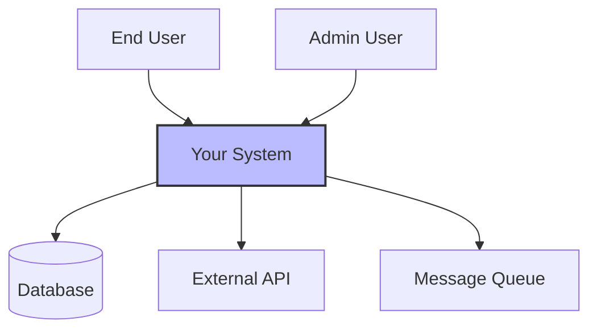
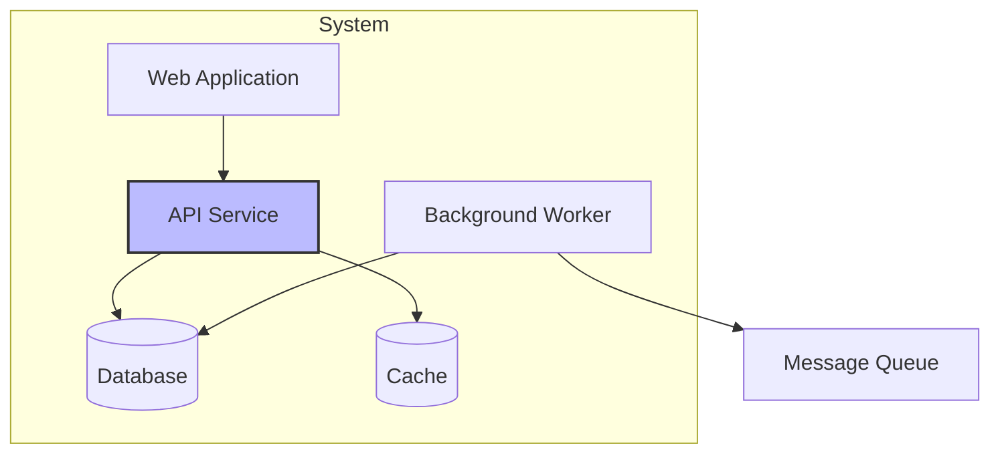
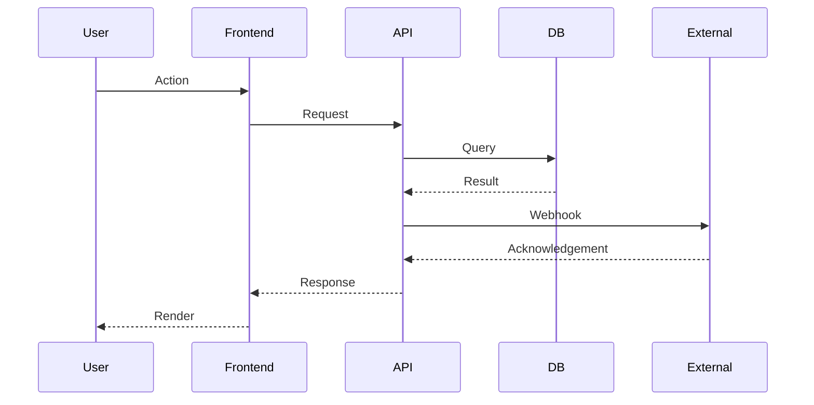
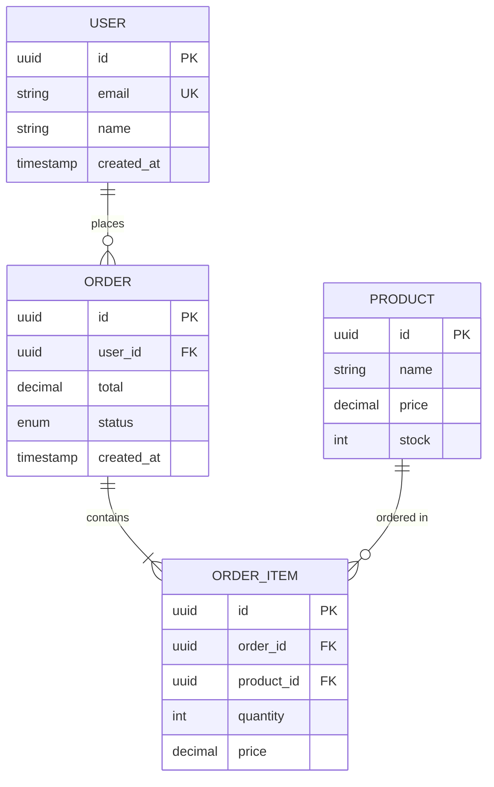
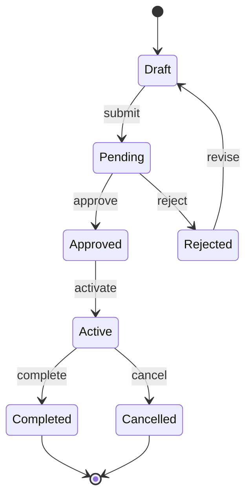
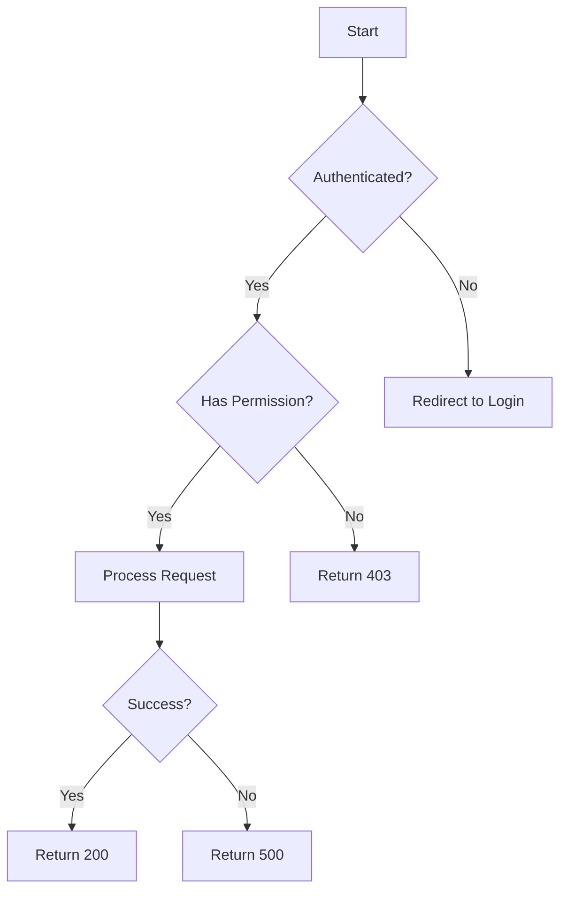
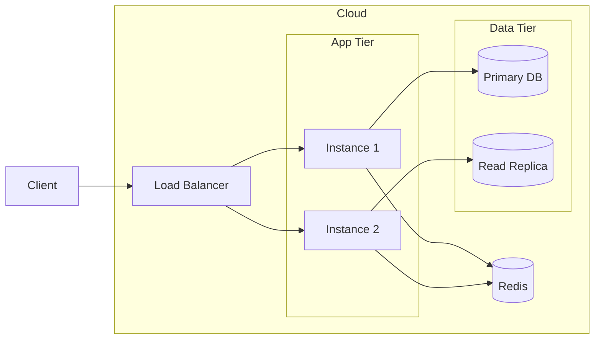

# Mermaid Diagram Patterns

Reference library for TECH_SPEC diagram generation. All diagrams use Mermaid syntax.

## C4 Context Diagram

Show system boundaries, actors, and external dependencies.

## C4 Container Diagram

Show internal components and their relationships.

## Sequence Diagram

Show interactions between components over time.

## Entity-Relationship Diagram (ERD)

Show data model relationships.

## State Machine Diagram

Show state transitions for entities with lifecycle.

## Flowchart (Decision Logic)

Show branching logic and decision points.

## Deployment / Infrastructure

Show deployment topology.

## Usage Notes

- Pick the diagram type that best communicates the architectural decision
- Keep diagrams focused — one concept per diagram
- Use notes/comments in Mermaid for non-obvious relationships
- C4 Context for high-level system boundaries
- Sequence for request/response flows
- ERD for data models
- State machines for entities with lifecycle
- Flowcharts for complex decision logic
