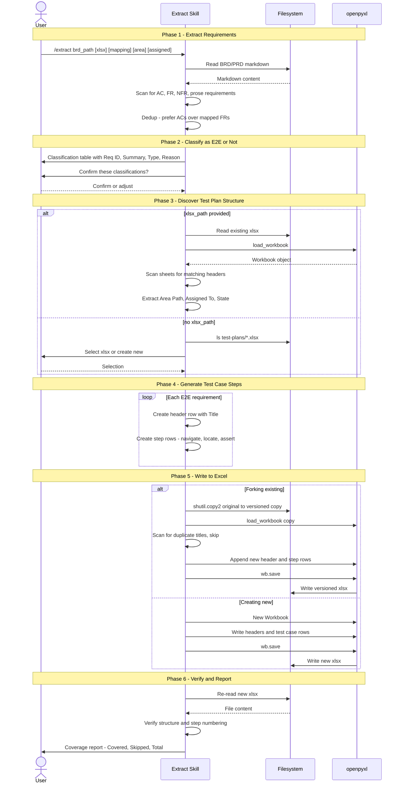

# Extract Skill — Sequence Diagram

```mermaid
sequenceDiagram
    actor User
    participant Skill as Extract Skill
    participant FS as Filesystem
    participant XL as openpyxl

    Note over User,XL: Phase 1 - Extract Requirements
    User->>Skill: /extract brd_path [xlsx] [mapping] [area] [assigned]
    Skill->>FS: Read BRD/PRD markdown
    FS-->>Skill: Markdown content
    Skill->>Skill: Scan for AC, FR, NFR, prose requirements
    Skill->>Skill: Dedup - prefer ACs over mapped FRs

    Note over User,XL: Phase 2 - Classify as E2E or Not
    Skill->>User: Classification table with Req ID, Summary, Type, Reason
    Skill->>User: Confirm these classifications?
    User-->>Skill: Confirm or adjust

    Note over User,XL: Phase 3 - Discover Test Plan Structure
    alt xlsx_path provided
        Skill->>FS: Read existing xlsx
        Skill->>XL: load_workbook
        XL-->>Skill: Workbook object
        Skill->>Skill: Scan sheets for matching headers
        Skill->>Skill: Extract Area Path, Assigned To, State
    else no xlsx_path
        Skill->>FS: ls test-plans/*.xlsx
        Skill->>User: Select xlsx or create new
        User-->>Skill: Selection
    end

    Note over User,XL: Phase 4 - Generate Test Case Steps
    loop Each E2E requirement
        Skill->>Skill: Create header row with Title
        Skill->>Skill: Create step rows - navigate, locate, assert
    end

    Note over User,XL: Phase 5 - Write to Excel
    alt Forking existing
        Skill->>FS: shutil.copy2 original to versioned copy
        Skill->>XL: load_workbook copy
        Skill->>Skill: Scan for duplicate titles, skip
        Skill->>XL: Append new header and step rows
        Skill->>XL: wb.save
        XL->>FS: Write versioned xlsx
    else Creating new
        Skill->>XL: New Workbook
        Skill->>XL: Write headers and test case rows
        Skill->>XL: wb.save
        XL->>FS: Write new xlsx
    end

    Note over User,XL: Phase 6 - Verify and Report
    Skill->>FS: Re-read new xlsx
    FS-->>Skill: File content
    Skill->>Skill: Verify structure and step numbering
    Skill->>User: Coverage report - Covered, Skipped, Total
```
