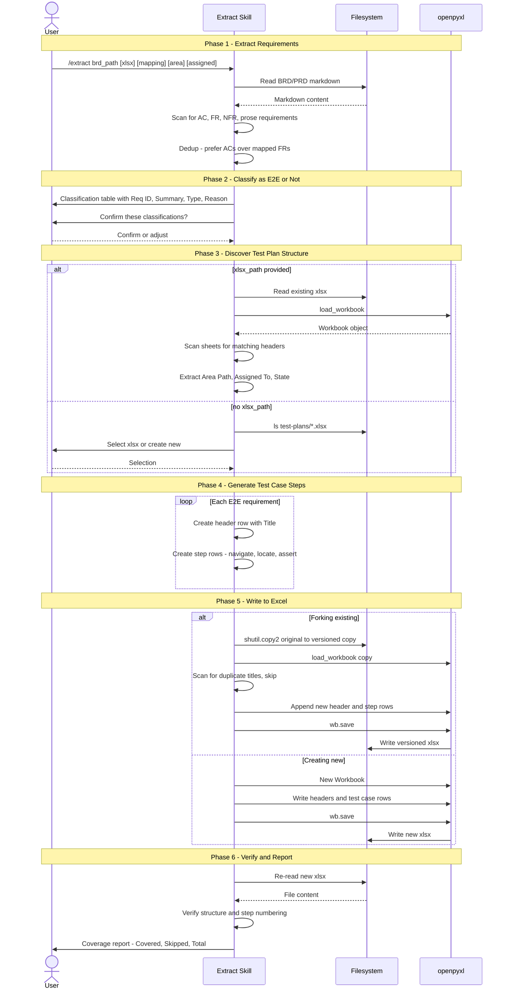

# Multi-Phase Skill

The structural pattern used by all [[Skill]] implementations. Each skill is broken into numbered phases (typically 4-10) with clear inputs, outputs, and gates between them.

## Extract Example (6 Phases)

1. **Extract Requirements** — scan BRD/PRD for AC-xxx, FR-xxx, NFR-xxx, prose requirements; dedup FRs mapped to ACs
2. **Classify as E2E** — present classification table, [[User Confirmation Gate|wait for confirmation]]
3. **Discover Test Plan Structure** — read existing xlsx headers or create new; resolve worksheet selection
4. **Generate Test Case Steps** — create header row + step rows per [[E2E Test Case]]
5. **Write to Excel** — fork via `shutil.copy2` ([[Idempotent Operation|never modify original]]), append rows, version naming
6. **Verify & Report** — re-read xlsx, confirm structure, print coverage report

### Sequence Diagram

## Ingest Example (9 Phases)

1. **Validate & Fingerprint** — check wiki exists, [[SHA-256 Fingerprinting|fingerprint]] source, dedup check
2. **Analyze Source** — extract entities, concepts, ideas from content
3. **Plan Wiki Updates** — present table, [[User Confirmation Gate|wait for approval]]
4. **Snapshot Source** — copy to [[Raw Sources]]
5. **Create/Update Pages** — write pages with frontmatter and wikilinks
6. **[[Cross-Reference Pass]]** — bidirectional linking
7. **Update [[Index]]** — maintain catalog
8. **Append to [[Log]]** — audit trail
9. **Report** — structured summary

## Benefits

- Clear error handling boundaries between phases
- User can abort at confirmation gates without partial writes
- Each phase has defined inputs and outputs
- Phases can reference shared concepts across skills

## Sources
- [[Source - Ingest SKILL]]
- [[Source - Extract SKILL]]
- [[Source - PRD Generator SKILL]]
- [[Source - Tech Spec Generator SKILL]]
- [[Source - Task JSON Converter SKILL]]
- [[Source - Azure Boards Sync SKILL]]
- [[Source - jx-dev Spec SKILL]]
- [[Source - jx-dev Task SKILL]]
