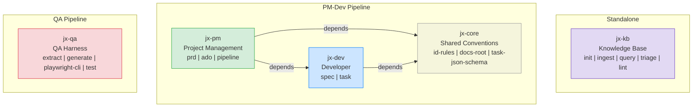
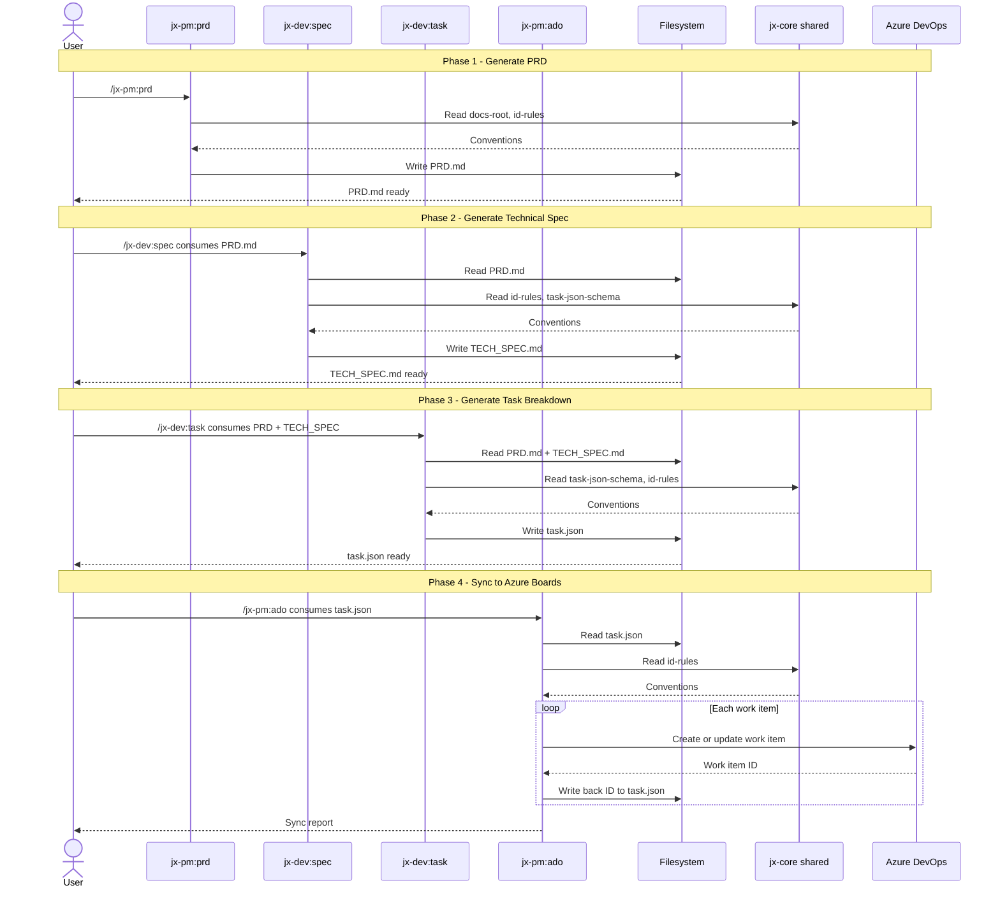
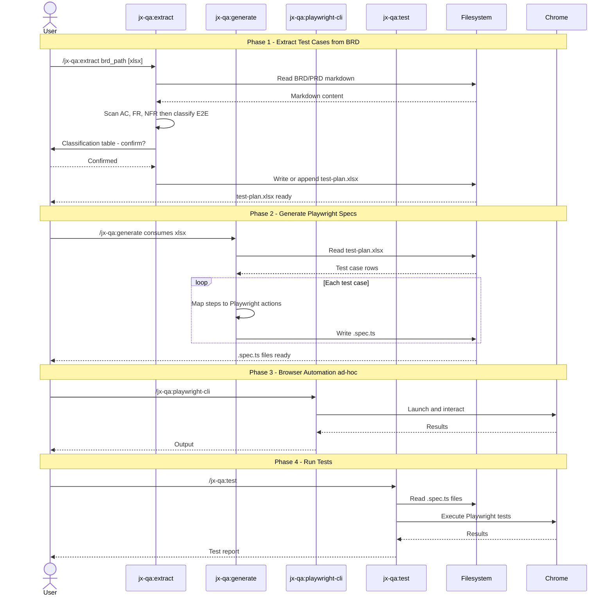
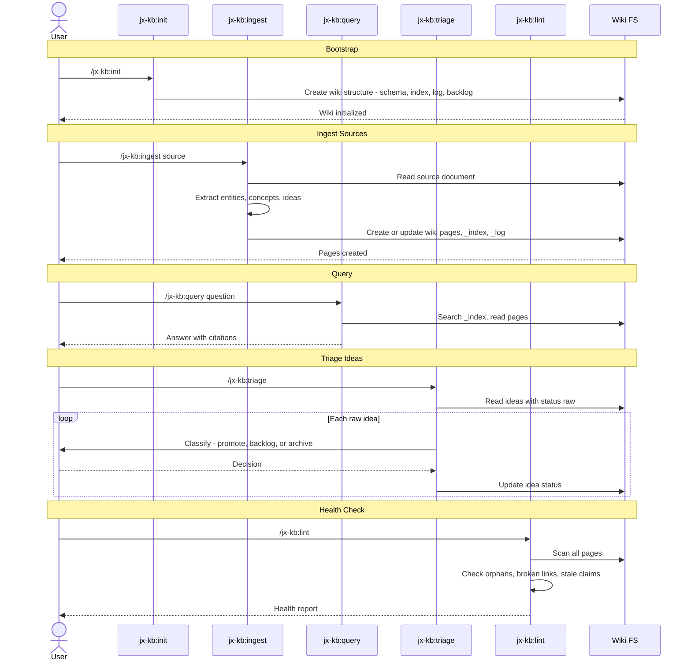

# Plugin Pipeline Sequence

Full system overview of all five jx-* plugins, their dependency graph, and the two primary pipelines (PM→Dev and QA).

> **Note:** Cross-plugin auto-chaining is deferred. Each skill is invoked manually by the User. Artifacts pass via filesystem.

---

## Plugin Dependency Graph

---

## PM → Dev Pipeline Sequence

---

## QA Pipeline Sequence

---

## jx-kb Pipeline (Independent)

---

## Artifact Flow Summary

| Step | Command | Input | Output |
|------|---------|-------|--------|
| 1 | `/jx-pm:prd` | User requirements | `PRD.md` |
| 2 | `/jx-dev:spec` | `PRD.md` | `TECH_SPEC.md` |
| 3 | `/jx-dev:task` | `PRD.md` + `TECH_SPEC.md` | `task.json` |
| 4 | `/jx-pm:ado` | `task.json` | Azure DevOps work items |
| 5 | `/jx-qa:extract` | BRD/PRD markdown | `test-plan.xlsx` |
| 6 | `/jx-qa:generate` | `test-plan.xlsx` | `.spec.ts` files |
| 7 | `/jx-qa:test` | `.spec.ts` files | Test report |

## See Also

- [[Skill Chaining]]
- [[Multi-Phase Skill]]
- [[Cross-Plugin Shared Convention Layer]]
