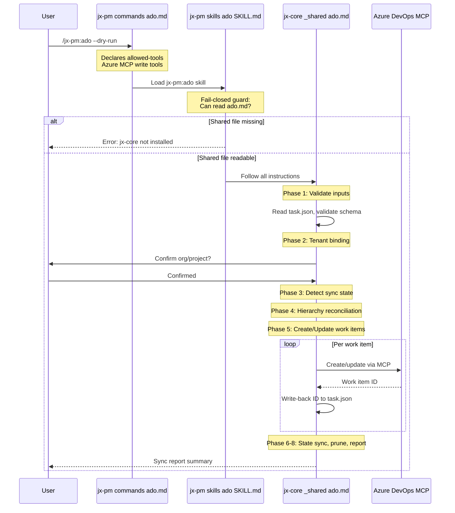
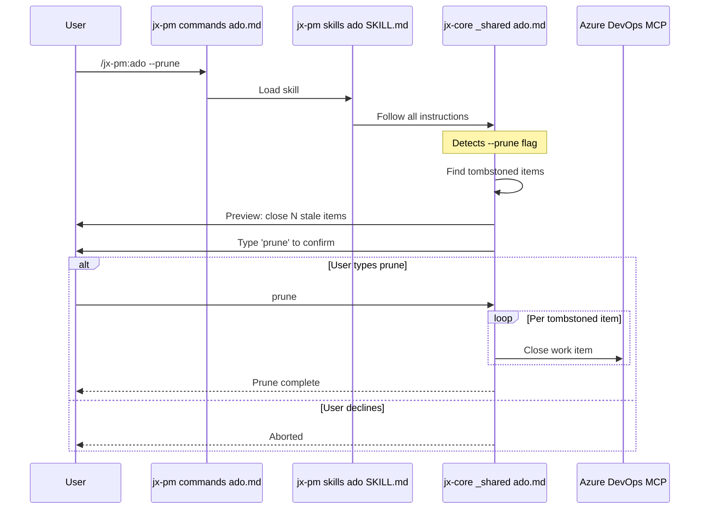

# Stub-Delegation Pattern

A SKILL.md that contains zero logic — only a fail-closed guard and a pointer to a shared executable file in another plugin. Separates permission surface from execution logic.

## The Problem

Cross-role skills (e.g., ADO sync, task conversion) need to be available from multiple role plugins without duplicating 200+ lines of logic. Moving the logic to a shared plugin (`jx-core`) while keeping the user-facing command in the role plugin requires a delegation mechanism.

## The Pattern

```
commands/ado.md          → declares allowed-tools, passes $ARGUMENTS
skills/ado/SKILL.md      → fail-closed stub (no logic)
  └→ jx-core/_shared/ado.md  → full executable logic
```

The stub contains three things:
1. **Frontmatter** — name, description, triggers (identical to what the full SKILL.md had)
2. **Fail-closed guard** — halt if the shared file is unreadable
3. **Single delegation instruction** — "Follow all instructions in `../../../jx-core/_shared/ado.md`"

## Security Model: Split Ownership

| Concern | Owner | Where |
|---------|-------|-------|
| Which MCP tools are authorized | Role plugin | `commands/ado.md` (`allowed-tools` field) |
| Destructive-operation confirmation gates | Shared file | `jx-core/_shared/ado.md` (typed confirmations) |
| Trigger conditions | Role plugin | `skills/ado/SKILL.md` frontmatter |
| Execution logic | Shared file | `jx-core/_shared/ado.md` |

Stubs cannot bypass gates because all gate logic lives in the shared file. The stub has no logic to skip, weaken, or override.

## Fail-Closed Guard

```markdown
**Fail-closed guard:** Before proceeding, verify `../../../jx-core/_shared/ado.md` is readable.
If the file cannot be read, halt immediately:
> "Error: jx-core shared ADO skill not found. Ensure the jx-core plugin is installed."
```

Without this guard, a missing `jx-core` dependency would silently produce a no-op skill instead of a clear error.

## Path Resolution

Relative paths in the shared file are anchored from the consuming SKILL.md (the stub), not from the shared file itself. Since all role plugins follow the same depth (`plugins/X/skills/Y/SKILL.md`), the `../../../jx-core/_shared/` path resolves correctly from any role stub's location.

Do NOT rewrite internal paths when moving logic to a shared file.

## When to Use

- Skill logic is needed by multiple role plugins
- Logic is complex enough that duplication creates drift risk (100+ lines)
- Destructive operations require confirmation gates that must not be diluted

## When NOT to Use

- Skill is role-specific with no reuse need — keep logic in the role plugin
- Shared logic is passive (schemas, rules) — use direct `_shared/` reference, no stub needed

## Sequence: ADO Sync via Stub-Delegation



## Sequence: Destructive Operation Gate



## Difference from Shared Reference Extraction

[[Shared Reference Extraction]] is for passive conventions (ID rules, schemas, config resolution) referenced inline within a skill. This pattern is for full executable skill logic that replaces the entire SKILL.md body.

| | Shared Reference | Stub-Delegation |
|---|---|---|
| Shared file contains | Rules, schemas, conventions | Complete executable skill logic |
| SKILL.md contains | Full logic + inline references | Zero logic, just a pointer |
| Example | `Apply rules from _shared/id-rules.md` | `Follow all instructions in _shared/ado.md` |

## Related

- [[Shared Reference Extraction]] — intra-plugin version for passive conventions
- [[Cross-Plugin Shared Convention Layer]] — the shared plugin pattern that hosts delegated logic
- [[Plugin Dependency Declaration]] — stubs require declared dependency on jx-core
- [[Core Shared Conventions Plugin]] — current host of shared executable logic
- [[Slash Feedback Skill for jx-core]] — v1 implementation using this pattern for jx-pm and jx-qa stubs

## Sources

None — emerged from the ADO sync / task skills extraction (2026-05-12).
